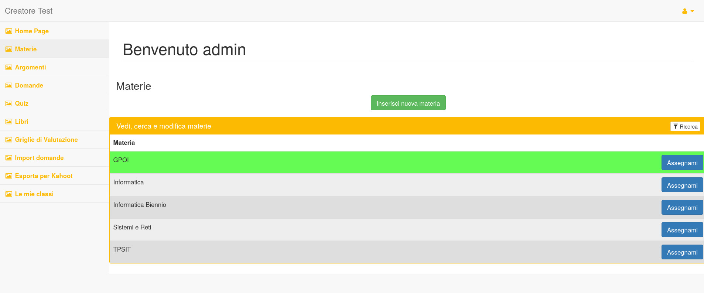

# CreatoreTestPublic
Un'applicazione web per la **creazione e la stampa di test**, pensato per le scuole. Nella parte **Rewarding** ci sono pagine per la *gamification* degli esercizi da svolgere.

Il codice lato server è scritto in **PHP**, mentre come database viene utilizzato **MySQL**.



## Struttura
### Cartella sql
All'interno della cartella `sql` è possibile trovare un file sql che si può importare all'interno di un database con tutte le tabelle necessarie al funzionamento del programma.
 
### Cartella share
All'interno della cartella `share` è possibile trovare un file `funzioni2_1.php` con all'interno le funzioni per la connessione al database e altre funzion utili all'applicazione.

## Installazione
E' necessario scaricare alcune dipendenze di PHP e per il framework HTML:

Requisiti:
- [Bower](https://bower.io/#install-bower)
- [Composer](https://getcomposer.org/download/)

```bash
bower install
php composer.phar install
```
A questo punto dovete **importare il database** da *phpMyAdmin* o da riga di comando. Il file da importare è in `sql/2024-12-32_creatoretest.sql`.

Duplica il file `config.sample.php` chiamandolo `config.inc.php`. All'interno dovrai inserire i dati di connessione del tuo database.

## Avvio
Accedendo da browser al percorso dell'applicazione sarà possibile avviarla. Se l'applicazione è stata scaricata nella vostra cartella di apache, normalmente è accessibile all'indirizzo:

> http://localhost/CreatoreTestPublic
> - **USERNAME:** admin
> - **PASSWORD:** admin
